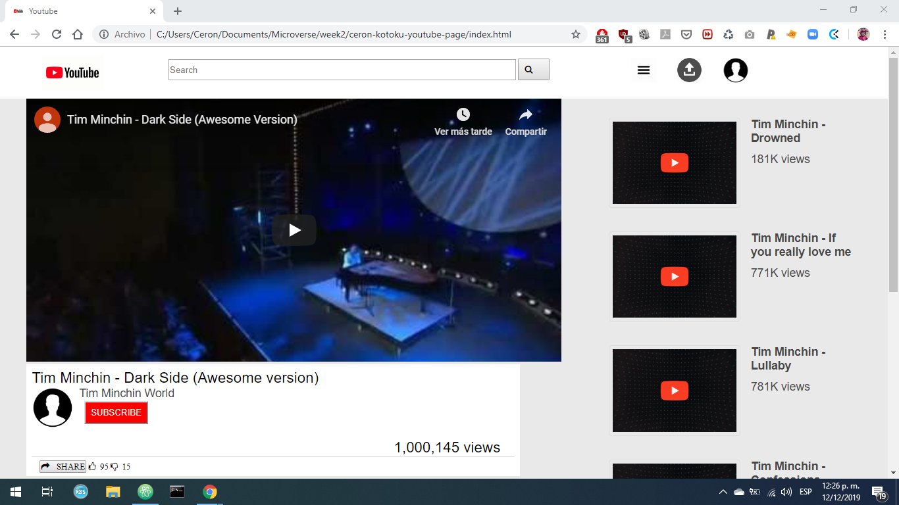

# Microverse First Proyect:
# Embedding Images and Video

About the project
This HTML/CSS project is the first on the Microverse course. The aim of the project is to make a clone of youtube previous version. 

##Preview Here's a link to a preview of our site.

The clone of the youtube video channel contains a: 

navigation bar (that contains: logo, searchbox-with button-, and user icons), 
the main video (contains: title, like and dislike, user avatar, views and subscribe button)
and a side bar with recommended videos (Contains: video title andd views).

## Built With

- HTML,
- CSS

## Live Demo

[Live Demo Link](http://htmlpreview.github.io/?https://github.com/kotoku-code/ceron-kotoku-youtube-page/blob/feature-youtube-page-prototype/index.html)

##Contributor

Jorge Cerón 
jorge.ceron.gil@gmail.com
